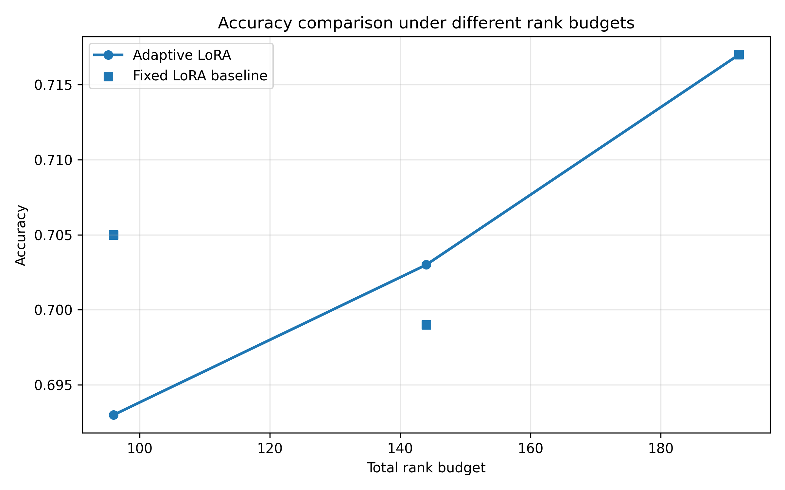
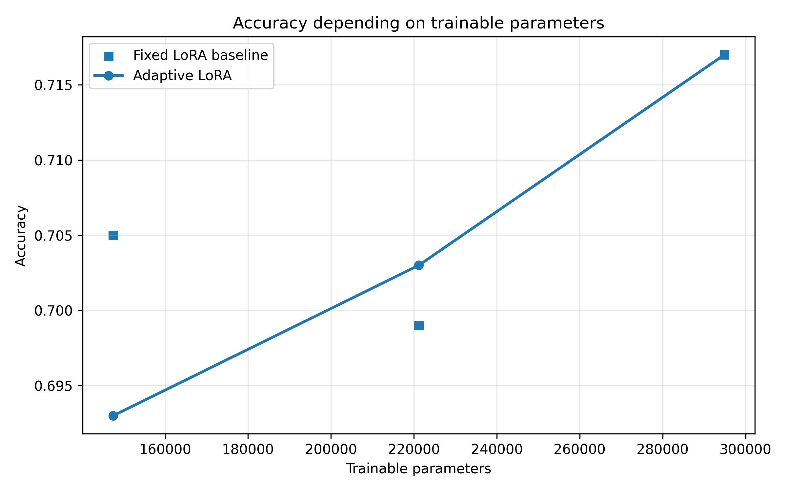
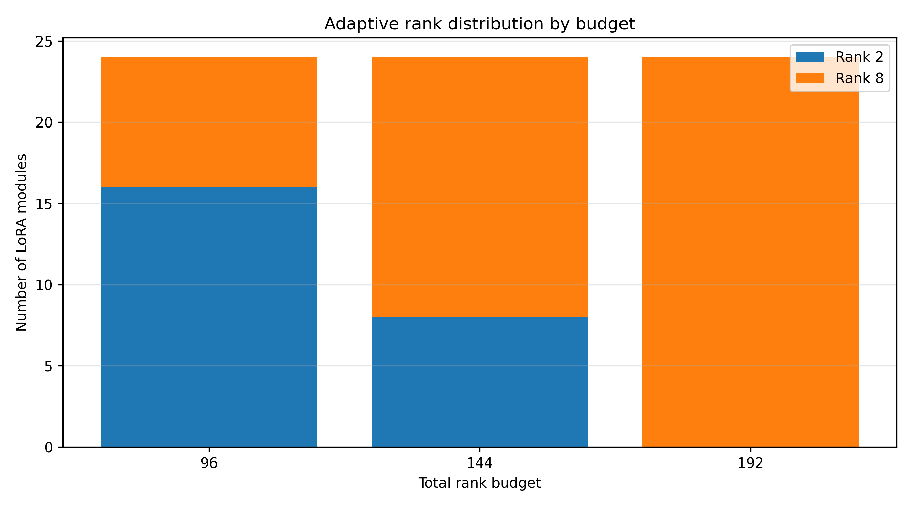
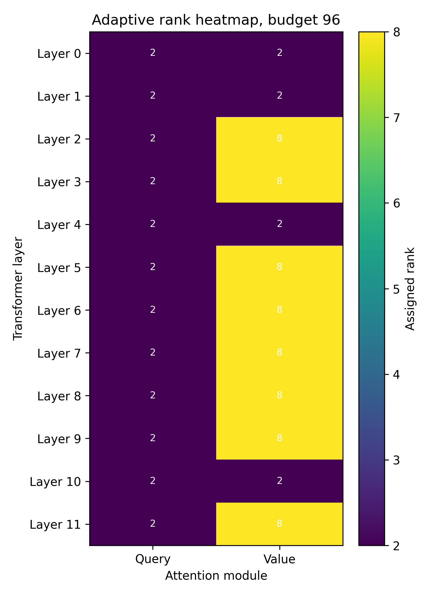
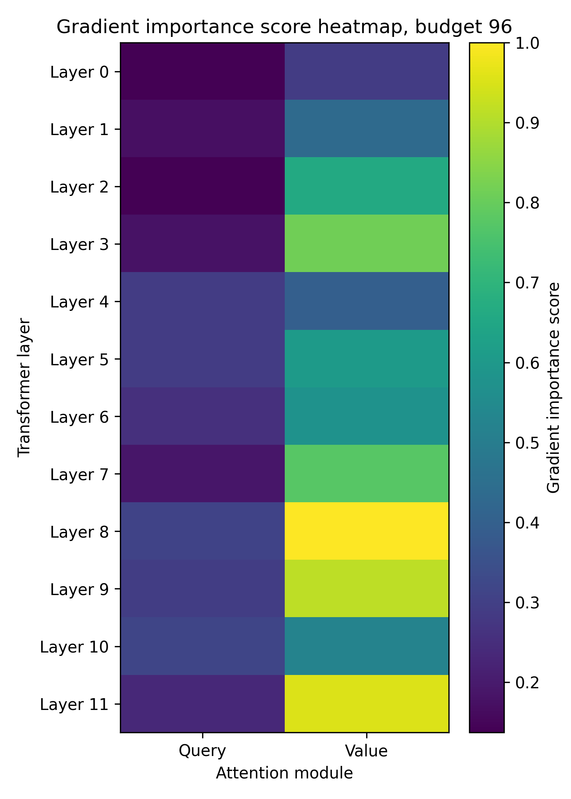

# DULoRA: Dynamic Utility-based LoRA Rank Allocation


DULoRA is a master's thesis research pipeline for studying **dynamic utility-based rank allocation in LoRA-based fine-tuning**.

The project compares a standard fixed-rank LoRA baseline with an adaptive LoRA configuration where ranks are assigned per layer according to gradient-based utility scores. The main goal is to analyze whether LoRA rank capacity can be distributed more efficiently across transformer layers under a fixed rank budget.

The current implementation focuses on binary sentiment classification using transformer models and the IMDb dataset as the main benchmark. The pipeline is built with PyTorch, Hugging Face Transformers, Hugging Face Datasets, PEFT, and the Hugging Face `Trainer` API.

---

## Table of Contents

- [Research Motivation](#research-motivation)
- [Research Objective](#research-objective)
- [Method Overview](#method-overview)
- [Adaptive Rank Allocation Algorithm](#adaptive-rank-allocation-algorithm)
- [Pipeline Overview](#pipeline-overview)
- [Current Experiment Results](#current-experiment-results)
- [Generated Thesis Plots](#generated-thesis-plots)
- [Generated Outputs](#generated-outputs)
- [Project Structure](#project-structure)
- [Installation](#installation)
- [Running an Experiment](#running-an-experiment)
- [How to reproduce the experiments](#how-to-reproduce-the-experiments)
- [Configuration](#configuration)
- [Reproducibility](#reproducibility)
- [Current Limitations](#current-limitations)
- [Future Work](#future-work)
- [Author](#author)

---

## Research Motivation

Low-Rank Adaptation, or LoRA, is a parameter-efficient fine-tuning technique that reduces the number of trainable parameters required to adapt large transformer models to downstream tasks.

In standard LoRA, the same rank value is usually applied to all selected target layers. However, not all layers necessarily contribute equally to the final task performance. Some layers may receive stronger optimization signals, while others may require less adaptation capacity.

DULoRA explores the hypothesis that LoRA rank should not always be distributed uniformly. Instead, rank capacity can be allocated according to layer utility, allowing more important layers to receive higher ranks while keeping less important layers at lower ranks.

The proposed approach estimates layer utility using gradient information collected during a short warmup stage and then distributes a fixed rank budget across LoRA target layers.

---

## Research Objective

The main objective of this project is to develop and evaluate an adaptive rank allocation method for LoRA-based fine-tuning of transformer models.

The project focuses on the following goals:

- Implement a reproducible LoRA fine-tuning pipeline for transformer-based text classification.
- Compare fixed-rank Baseline LoRA with Adaptive Gradient-Aware LoRA.
- Estimate layer utility using gradient norms from LoRA parameters.
- Allocate per-layer LoRA ranks under a configurable total rank budget.
- Save metrics, layer scores, rank patterns, allocation history, and plots for thesis analysis.
- Provide a clean experiment structure suitable for academic reporting and future extensions.

---

## Method Overview

The experiment pipeline follows three main stages.

### 1. Baseline LoRA

A standard LoRA model is trained using a fixed rank value defined in the configuration file.

This baseline is used as the reference point for evaluating the adaptive method.

Example:

```yaml
baseline_lora:
  r: 8
```

In this case, all selected LoRA target layers use rank `r = 8`.

---

### 2. Layer Utility Scoring

A temporary LoRA scoring model is created using the minimum adaptive rank. During a short warmup stage, the model processes a configurable number of batches and collects gradients from LoRA parameters.

The gradient norms are used as utility indicators for each LoRA layer.

The intuition is that layers with stronger gradient signals may benefit from receiving more rank capacity during the final adaptive training stage.

Example:

```yaml
adaptive_lora:
  min_rank: 2
  warmup_steps: 20
```

---

### 3. Adaptive LoRA

After computing layer utility scores, the pipeline creates a final adaptive LoRA model.

Instead of assigning the same rank to every layer, the model receives a `rank_pattern`, where each target layer can have a different rank.

The rank allocator starts with `min_rank` for all target layers and then increases the rank of selected layers according to their utility scores, while respecting the following constraints:

- Minimum rank per layer.
- Maximum rank per layer.
- Rank increment step.
- Total rank budget.

Example:

```yaml
adaptive_lora:
  min_rank: 2
  max_rank: 8
  rank_step: 2
  total_budget: 96
```

The core allocation logic is implemented in:

```text
src/rank_allocator.py
```

---

## Adaptive Rank Allocation Algorithm

### Method Overview


Figure: Overall workflow of the adaptive gradient-aware LoRA rank allocation algorithm.

DULoRA uses a gradient-aware rank allocation strategy.

Let each LoRA target layer be represented as:

```text
l = 1, 2, ..., L
```

Each layer receives a utility score:

```text
u_l
```

where `u_l` is computed from the gradient norms of LoRA parameters during the scoring stage.

The algorithm starts by assigning the minimum rank to each layer:

```text
r_l = r_min
```

Then, while the total budget allows further allocation, the algorithm selects the layer with the highest utility score that has not reached the maximum rank:

```text
r_l = r_l + rank_step
```

The process continues until one of the following conditions is met:

- The total rank budget is reached.
- All layers have reached the maximum rank.
- No further valid allocation is possible.

The final result is a layer-wise rank pattern:

```text
rank_pattern = {
  layer_1: r_1,
  layer_2: r_2,
  ...
  layer_L: r_L
}
```

This rank pattern is then passed to PEFT when building the adaptive LoRA model.

---

## Pipeline Overview

The complete experimental pipeline can be summarized as follows:

```text
IMDb Dataset
     ↓
Tokenization
     ↓
Baseline LoRA Training
     ↓
Gradient-based Layer Utility Scoring
     ↓
Adaptive Rank Allocation
     ↓
Adaptive LoRA Training
     ↓
Evaluation
     ↓
Metrics, CSV Files, and Plots
```

<!-- ESPAÑOL:
Aquí puedes agregar una imagen bonita del pipeline general.
Recomendación: crear una imagen llamada assets/pipeline_overview.png.

Ejemplo:


La imagen debería mostrar algo como:
Dataset → Tokenization → Baseline LoRA → Gradient Scoring → Rank Allocation → Adaptive LoRA → Evaluation.
-->

## Current Experiment Results

The current fair-budget experiments compare fixed-rank LoRA against Adaptive
Gradient-Aware LoRA on IMDb sentiment classification using `bert-base-uncased`.
The values below are read from the generated CSV files under `outputs/`.

| Method | Rank budget | Trainable parameters | Accuracy | Loss | Parameter reduction |
| --- | ---: | ---: | ---: | ---: | ---: |
| Fixed LoRA `r=4` | 96 | 147,456 | 0.705 | 0.6609 | - |
| Adaptive LoRA | 96 | 147,456 | 0.693 | 0.6652 | 0.0% vs `r=4` |
| Fixed LoRA `r=6` | 144 | 221,184 | 0.699 | 0.6597 | - |
| Adaptive LoRA | 144 | 221,184 | 0.703 | 0.6602 | 0.0% vs `r=6` |
| Fixed LoRA `r=8` | 192 | 294,912 | 0.717 | 0.6601 | - |
| Adaptive LoRA | 192 | 294,912 | 0.717 | 0.6601 | 0.0% vs `r=8` |

In the fair-budget setting, each adaptive configuration is compared with a
fixed-rank baseline that has the same total rank budget. Therefore, the
trainable parameter count is equal within each pair. Adaptive LoRA with budget
`192` reproduces the fixed LoRA `r=8` result because all 24 LoRA modules receive
rank `8`. With budget `144`, Adaptive LoRA keeps accuracy close to the fixed
LoRA baseline and is slightly higher in this run, while using fewer parameters
than the full `r=8` setting. With budget `96`, Adaptive LoRA uses the smaller
parameter budget and preserves competitive accuracy, although it does not
outperform the matched fixed LoRA `r=4` baseline in this run.

The adaptive rank distributions are:

| Budget | Rank 2 modules | Rank 4 modules | Rank 6 modules | Rank 8 modules |
| ---: | ---: | ---: | ---: | ---: |
| 96 | 16 | 0 | 0 | 8 |
| 144 | 8 | 0 | 0 | 16 |
| 192 | 0 | 0 | 0 | 24 |

## Generated Thesis Plots

The final thesis plots are saved in `outputs/final_plots/`.

| Figure | Description |
| --- | --- |
| `accuracy_vs_budget.png` | Compares fixed LoRA and Adaptive LoRA accuracy under rank budgets 96, 144, and 192. |
| `accuracy_vs_trainable_params.png` | Shows accuracy as a function of trainable parameter count. |
| `rank_distribution_by_budget.png` | Summarizes how many LoRA modules receive rank 2, 4, 6, or 8 for each budget. |
| `rank_heatmap_budget_96.png` | Shows the layer-wise adaptive rank pattern for budget 96. |
| `rank_heatmap_budget_144.png` | Shows the layer-wise adaptive rank pattern for budget 144. |
| `rank_heatmap_budget_192.png` | Shows that budget 192 assigns rank 8 to every LoRA module, equivalent to fixed LoRA `r=8`. |
| `gradient_score_heatmap_budget_96.png` | Visualizes gradient-based layer importance scores used for adaptive allocation. |











---

## Generated Outputs

Each experiment run saves the following artifacts inside its output directory:

The `outputs/` directory is intended to store lightweight experiment artifacts
such as CSV tables and PNG figures. The current pipeline uses
`save_strategy="no"` in Hugging Face `Trainer`, so these folders are not meant
to contain full model checkpoints.

```text
outputs/<experiment_name>/
│
├── metrics.csv
├── layer_scores.csv
├── rank_pattern.csv
├── allocation_history.csv
│
├── layer_scores.png
├── rank_pattern.png
├── budget_history.png
│
├── baseline_lora/
└── adaptive_lora/
```

### Output Files

| File | Description |
| --- | --- |
| `metrics.csv` | Baseline and adaptive accuracy, loss, training time, and parameter counts. |
| `layer_scores.csv` | Normalized gradient-based utility score for each LoRA layer. |
| `rank_pattern.csv` | Final adaptive rank assigned to each target layer. |
| `allocation_history.csv` | Iteration-by-iteration record of rank budget allocation. |
| `layer_scores.png` | Bar plot of layer utility scores. |
| `rank_pattern.png` | Bar plot of assigned adaptive ranks. |
| `budget_history.png` | Plot of rank budget usage over allocation iterations. |
| `baseline_lora/` | Hugging Face `Trainer` output directory for Baseline LoRA. |
| `adaptive_lora/` | Hugging Face `Trainer` output directory for Adaptive LoRA. |

---

## Project Structure

```text
DULoRA-Dynamic-Utility-based-LoRA-Rank-Allocation/
│
├── configs/
│   ├── imdb_sentiment_final.yaml
│   ├── ag_news_topic_final.yaml
│   ├── beans_image_final.yaml
│   ├── fair_budget_96.yaml
│   ├── fair_budget_144.yaml
│   └── fair_budget_192.yaml
│
├── outputs/
│   ├── fair_budget_96/
│   ├── fair_budget_144/
│   ├── fair_budget_192/
│   └── final_plots/
│
├── src/
│   ├── __init__.py
│   ├── data.py
│   ├── model.py
│   ├── rank_allocator.py
│   ├── experiment.py
│   ├── plots.py
│   ├── utils.py
│   └── evaluate.py
│
├── run_experiment.py
├── generate_final_plots.py
├── regenerate_experiment_plots.py
├── requirements.txt
├── README.md
└── .gitignore
```

---

## Main Components

| File | Purpose |
| --- | --- |
| `configs/imdb_sentiment_final.yaml` | Final IMDb sentiment classification configuration. |
| `configs/ag_news_topic_final.yaml` | Final AG News topic classification configuration. |
| `configs/beans_image_final.yaml` | Final Beans image classification configuration. |
| `configs/fair_budget_*.yaml` | Fair-budget IMDb comparison configs for budgets 96, 144, and 192. |
| `src/data.py` | Loads and preprocesses text or image datasets. |
| `src/model.py` | Builds text or image classification models and applies LoRA through PEFT. |
| `src/rank_allocator.py` | Collects gradient-based layer scores and allocates adaptive ranks. |
| `src/experiment.py` | Orchestrates baseline training, scoring, adaptive training, and output saving. |
| `src/evaluate.py` | Defines evaluation metrics for Hugging Face `Trainer`. |
| `src/plots.py` | Saves CSV files and plots for analysis. |
| `src/utils.py` | Handles config loading, seed control, device selection, and parameter counting. |
| `run_experiment.py` | Command-line entrypoint for running experiments. |
| `generate_final_plots.py` | Generates consolidated thesis figures from fair-budget outputs. |
| `regenerate_experiment_plots.py` | Regenerates per-experiment plots from existing CSV files. |

---

## Installation

Create and activate a Python virtual environment:

```bash
python3 -m venv .venv
source .venv/bin/activate
```

Install dependencies:

```bash
pip install -r requirements.txt
```

The project depends on:

- PyTorch
- Hugging Face Transformers
- Hugging Face Datasets
- PEFT
- Accelerate
- Evaluate
- Scikit-learn
- Matplotlib
- Pandas
- PyYAML

<!-- ESPAÑOL:
Opcionalmente puedes agregar aquí la versión de Python recomendada.
Por ejemplo:

This project was tested with Python 3.10.

Si trabajaste en Colab, también puedes poner:

The experiments were mainly executed in Google Colab using GPU acceleration.
-->

---

## Running an Experiment

Run the IMDb sentiment final configuration:

```bash
python run_experiment.py --config configs/imdb_sentiment_final.yaml
```

Run the AG News topic classification configuration:

```bash
python run_experiment.py --config configs/ag_news_topic_final.yaml
```

Run the Beans image classification configuration:

```bash
python run_experiment.py --config configs/beans_image_final.yaml
```

---

## How to reproduce the experiments

To reproduce the fair-budget experiments used for the thesis comparison, run:

```bash
python run_experiment.py --config configs/fair_budget_96.yaml
python run_experiment.py --config configs/fair_budget_144.yaml
python run_experiment.py --config configs/fair_budget_192.yaml
python generate_final_plots.py
```

The generated metrics and plots will be saved under:

```text
outputs/<experiment_name>/
```

### Fair budget comparison experiments

These configurations compare Adaptive LoRA against fixed-rank LoRA under
approximately equivalent rank budgets:

- Fixed LoRA `r=4` vs Adaptive LoRA budget `96`.
- Fixed LoRA `r=6` vs Adaptive LoRA budget `144`.
- Fixed LoRA `r=8` vs Adaptive LoRA budget `192`.

Run only the fair-comparison training jobs with:

```bash
python run_experiment.py --config configs/fair_budget_96.yaml
python run_experiment.py --config configs/fair_budget_144.yaml
python run_experiment.py --config configs/fair_budget_192.yaml
```

### Final thesis plots

After running the fair-comparison experiments, generate the final thesis-ready
plots with:

```bash
python generate_final_plots.py
```

The script reads `outputs/fair_budget_96`, `outputs/fair_budget_144`, and
`outputs/fair_budget_192`, then saves the consolidated figures and summary CSV
under:

```text
outputs/final_plots/
```

## Configuration

The fair-budget IMDb configurations follow this structure:

```yaml
seed: 42
experiment_name: fair_budget_96
output_dir: outputs

dataset:
  name: imdb
  text_column: text
  train_size: 2000
  test_size: 1000
  max_length: 256

model:
  name: bert-base-uncased
  num_labels: 2

training:
  epochs: 2
  batch_size: 8
  learning_rate: 0.00005
  logging_steps: 50

lora:
  alpha: 16
  dropout: 0.1
  target_modules:
    - query
    - value

baseline_lora:
  r: 4

adaptive_lora:
  algorithm: gradient_aware
  min_rank: 2
  max_rank: 8
  rank_step: 2
  total_budget: 96
  warmup_steps: 20
```

### Configuration Fields

| Field | Description |
| --- | --- |
| `seed` | Random seed used for reproducibility. |
| `experiment_name` | Name of the output folder for the experiment. |
| `output_dir` | Root directory where experiment outputs are saved. |
| `dataset.name` | Hugging Face dataset name. |
| `dataset.train_size` | Number of training samples used. |
| `dataset.test_size` | Number of evaluation samples used. |
| `dataset.max_length` | Maximum tokenized sequence length. |
| `model.name` | Pretrained transformer model name. |
| `model.num_labels` | Number of output labels. |
| `training.epochs` | Number of training epochs. |
| `training.batch_size` | Training and evaluation batch size. |
| `training.learning_rate` | Optimizer learning rate. |
| `lora.alpha` | LoRA scaling factor. |
| `lora.dropout` | LoRA dropout value. |
| `lora.target_modules` | Transformer modules where LoRA is applied. |
| `baseline_lora.r` | Fixed LoRA rank used by the baseline model. |
| `adaptive_lora.min_rank` | Minimum rank assigned to each adaptive LoRA layer. |
| `adaptive_lora.max_rank` | Maximum rank allowed for each adaptive LoRA layer. |
| `adaptive_lora.rank_step` | Increment used when increasing a layer rank. |
| `adaptive_lora.total_budget` | Total rank budget available for adaptive allocation. |
| `adaptive_lora.warmup_steps` | Number of batches used for gradient-based scoring. |

---

## Output Directory Behavior

Experiments are saved in a dedicated run directory.

If `experiment_name` is provided:

```yaml
experiment_name: budget_144
output_dir: outputs
```

the run is saved to:

```text
outputs/budget_144/
```

If `experiment_name` is omitted, the pipeline creates a timestamped folder:

```text
outputs/run_2026-05-08_15-30-20/
```

This prevents results from different runs from being accidentally overwritten.

---

## Reproducibility

The pipeline uses the configured `seed` to improve reproducibility:

- Dataset shuffling uses the configured seed.
- Baseline, scoring, and adaptive model initialization reset the seed before model construction.
- Hugging Face `TrainingArguments` receives both `seed` and `data_seed`.
- Output folders are isolated by `experiment_name` or timestamp.

Exact reproducibility may still depend on hardware, backend behavior, CUDA/cuDNN settings, and library versions.

<!-- ESPAÑOL:
Si quieres ser más preciso, puedes agregar versiones reales de tus librerías.
Por ejemplo:

The main experiments were executed with:
- Python 3.10
- PyTorch ...
- Transformers ...
- PEFT ...

Pero solo ponlo si estás seguro de las versiones.
-->

---

## Current Evaluation

The current evaluation reports:

- Accuracy
- Evaluation loss
- Training time
- Trainable parameter count
- Total parameter count

These values are returned by the experiment pipeline and saved to:

```text
metrics.csv
```

---

## Example Research Questions

This repository is designed to support the following research questions:

- Can gradient-based utility scores identify LoRA layers that benefit from higher rank?
- Does adaptive rank allocation improve performance under the same or similar trainable parameter budget?
- How does the total rank budget affect accuracy, loss, and parameter efficiency?
- Are rank allocations stable across different seeds, dataset sizes, or model architectures?
- Which transformer layers tend to receive higher adaptive ranks during fine-tuning?

---

## Current Limitations

The current implementation has several limitations:

- The main benchmark is currently IMDb binary sentiment classification.
- The adaptive allocation is performed before final training and is not updated dynamically during training.
- The current utility function is based on gradient norms only.
- Results may vary across random seeds, hardware, and library versions.
- More experiments are needed to validate the method across additional datasets and model architectures.
- The current comparison focuses mainly on accuracy, loss, training time, and parameter count.

These limitations are part of the ongoing research process and provide directions for future improvements.

---

## Future Work

Possible extensions include:

- Testing additional datasets beyond IMDb.
- Evaluating other transformer backbones such as RoBERTa, DistilBERT, or DeBERTa.
- Extending the method to topic classification datasets such as AG News.
- Extending the method to image classification with Vision Transformers.
- Running experiments with multiple random seeds.
- Adding confidence intervals and statistical analysis.
- Comparing different utility functions for rank allocation.
- Updating rank allocation dynamically during training.
- Logging experiments with Weights & Biases or TensorBoard.
- Extending evaluation metrics beyond accuracy.
- Adding automated experiment tables for thesis reporting.
- Creating a more detailed ablation study for rank budget, warmup steps, and rank constraints.

---

## Academic Context

This repository was developed as part of a master's thesis project on parameter-efficient fine-tuning of transformer models.

The research focuses on adaptive rank allocation in LoRA and investigates whether layer-wise rank distribution can improve the efficiency of transformer fine-tuning under constrained parameter budgets.

<!-- ESPAÑOL:
Aquí puedes agregar el título exacto de tu tesis en inglés o ruso.

Por ejemplo:

Master's thesis topic:
"Development of an Adaptive Rank Allocation Algorithm in the Low-Rank Adaptation Method for Efficient Fine-Tuning of Transformer Models"

O en ruso:

«Разработка алгоритма адаптивного распределения ранга в методе Low-Rank Adaptation для эффективной настройки трансформерных моделей»
-->

---

## Citation

<!-- ESPAÑOL:
Esto es opcional.
Puedes dejarlo si quieres que el repo se vea más académico.
Si todavía no quieres usarlo, puedes eliminar esta sección.
-->

If you use this repository or refer to this work, please cite it as:

```bibtex
@mastersthesis{mendoza2026dulora,
  title={Dynamic Utility-based LoRA Rank Allocation for Efficient Transformer Fine-Tuning},
  author={Mendoza, Duvan},
  university={MEPhI - Moscow Engineering Physics Institute},
  year={2026}
}
```

---

## Author

Duvan Mendoza  
MSc Software Engineering and Big Data  
MEPhI - Moscow Engineering Physics Institute

Research focus:

- Machine Learning
- Natural Language Processing
- Transformer Models
- Parameter-Efficient Fine-Tuning
- LoRA Rank Allocation
